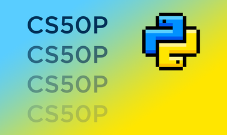

# Harvardx: CS50's Introduction to Programming with Python

## Welcome to Lazer's CS50P Repository

### [Academic Honesty](https://cs50.harvard.edu/python/2022/honesty/)

In this repository I will be documenting my progress in Harvard University's introduction to programming with Python [CS50P](https://cs50.harvard.edu/python/2022/) course. Here, you can follow my learning and find my projects and notes. Happy coding!
  

## [0 - Functions, Variables](https://cs50.harvard.edu/python/2022/weeks/0/)

- Lecture 0 - [Official Notes](https://cs50.harvard.edu/python/2022/notes/0/) - [Notes](w0_functions_variables/lecture0.md)

- Problem Set 0 - [Notes](w0_functions_variables/problem_set0.md)
    - [Indoor Voice](w0_functions_variables/indoor.py)
    - [Playback Speed](w0_functions_variables/playback.py)
    - [Making Faces](w0_functions_variables/faces.py)
    - [Einstein](w0_functions_variables/einstein.py)
    - [Tip Calculator](w0_functions_variables/tip.py)
  

## [1 - Conditionals](https://cs50.harvard.edu/python/2022/weeks/1/)

- Lecture 1 - [Official Notes](https://cs50.harvard.edu/python/2022/notes/1/) - [Notes](w1_conditionals/lecture1.md)

- Problem Set 1 - [Notes](w1_conditionals/problem_set1.md)
    - [Deep Thought](w1_conditionals/deep.py)
    - [Home Federal Savings Bank](w1_conditionals/bank.py)
    - [File Extensions](w1_conditionals/extensions.py)
    - [Math Interpreter](w1_conditionals/interpreter.py)
    - [Meal Time](w1_conditionals/meal.py)
  

## [2 - Loops](https://cs50.harvard.edu/python/2022/weeks/2/)

- Lecture 2 - [Official Notes](https://cs50.harvard.edu/python/2022/notes/2/) - [Notes](w2_loops/lecture2.md)

- Problem Set 2 - [Notes](w2_loops/problem_set2.md)
    - [camelCase](w2_loops/camel.py)
    - [Coke Machine](w2_loops/coke.py)
    - [just setting up my twttr](w2_loops/twttr.py)
    - [Vanity Plates](w2_loops/plates.py)
    - [Nutrition Facts](w2_loops/nutrition.py)
  

## [3 - Exceptions](https://cs50.harvard.edu/python/2022/weeks/3/)

- Lecture 3 - [Official Notes](https://cs50.harvard.edu/python/2022/notes/3/) - [Notes](w3_exceptions/lecture3.md)

- Problem Set 3 - [Notes](w3_exceptions/problem_set3.md)
    - [Fuel Gauge](w3_exceptions/fuel.py)
    - [Felipe's Taqueria](w3_exceptions/taqueria.py)
    - [Grocery List](w3_exceptions/grocery.py)
    - [Outdated](w3_exceptions/outdated.py)
    

## [4 - Libraries](https://cs50.harvard.edu/python/2022/weeks/4/)

- Lecture 4 - [Official Notes](https://cs50.harvard.edu/python/2022/notes/4/) - [Notes](w4_libraries/lecture4.md)

- Problem Set 4 - [Notes](w4_libraries/problem_set4.md)
    - [Emojize](w4_libraries/emojize.py)
    - [Frank, Ian and Glen's Letters](w4_libraries/figlet.py)
    - [Adieu, Adieu](w4_libraries/adieu.py)
    - [Guessing Game](w4_libraries/game.py)
    - [Little Professor](w4_libraries/professor.py)
    - [Bitcoin Price Index](w4_libraries/bitcoin.py)
    

## [5 - Unit Tests](https://cs50.harvard.edu/python/2022/weeks/5/)

- Lecture 5 - [Official Notes](https://cs50.harvard.edu/python/2022/notes/5/) - [Notes](w5_unit-tests/lecture5.md)

- Problem Set 5 - [Notes](w5_unit-tests/problem_set5.md)
    - Testing my twttr -  [twttr.py](w5_unit-tests/test_twttr/twttr.py) - [test_twttr.py](w5_unit-tests/test_twttr/test_twttr.py)
    - Back to the Bank - [bank.py](w5_unit-tests/test_bank/bank.py) - [test_bank.py](w5_unit-tests/test_bank/test_bank.py)
    - Re-requesting a Vanity Plate - [plates.py](w5_unit-tests/test_plates/plates.py) - [test_plates.py](w5_unit-tests/test_plates/test_plates.py)
    - Refueling - [fuel.py](w5_unit-tests/test_fuel/fuel.py) - [test_fuel.py](w5_unit-tests/test_fuel/test_fuel.py)
    

## [6 - File I/O](https://cs50.harvard.edu/python/2022/weeks/6/)

- Lecture 6 - [Official Notes](https://cs50.harvard.edu/python/2022/notes/6/) - [Notes](w6_file-io/lecture6.md)

- Problem Set 6 - [Notes](w6_file-io/problem_set6.md)
  - [Lines of Code](w6_file-io/lines/lines.py)
  - [Pizza Py](w6_file-io/pizza/pizza.py)
  - [Scourgify](w6_file-io/scourgify/scourgify.py)
  - [CS50 P-Shirt](w6_file-io/shirt/shirt.py)
    

## [7 - Regular Expressions](https://cs50.harvard.edu/python/2022/weeks/7/)

- Lecture 7 - [Official Notes](https://cs50.harvard.edu/python/2022/notes/7/) - [Notes](w7_regular_expressions/lecture7.md)

- Problem Set 7 - 